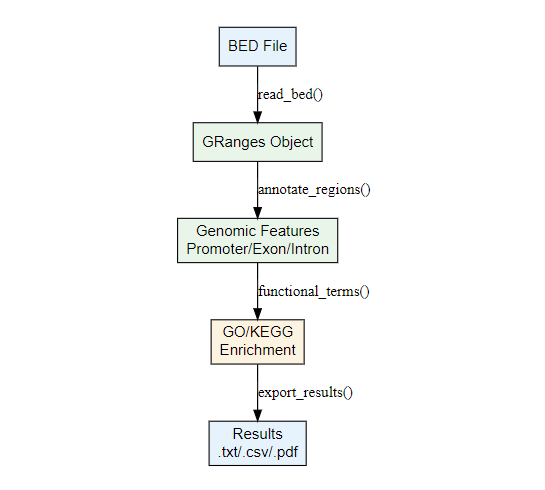

# ReAnnotateR

<!-- badges: start -->
<!-- badges: end -->

## Description

**ReAnnotateR** provides a complete workflow for adding biological meaning to genomic regions stored in BED files, a widely used format for representing genomic coordinates across experiments such as ChIP-seq, ATAC-seq, methylation profiling, structural variant detection, and non-canonical DNA structure mapping. Unlike tools that target specific experiment types or single analysis steps, **ReAnnotateR** remains broad enough to use regardless of experiment type, and allows for flexibility of choosing reference genome. This streamlines analyses that would otherwise require multiple packages and manual data integration.

ReAnnotateR was developed using R version 4.5.2 on Windows 11, with cursory compatability testing on macOS

## Installation

To install the latest version of the package:
```r
install.packages("devtools")
library("devtools")
devtools::install_github("giills/ReAnnotateR", build_vignettes = TRUE)
library("ReAnnotateR")
```
## To Run the Shiny App

After installing and loading **ReAnnotateR**, you can launch the Shiny application in two ways:

### Option 1: Using the wrapper function

The package provides a convenience function that starts the Shiny app:

```r
library(ReAnnotateR)
RunReAnnotateR()
```
### Option 2: Running the app directly
You can also launch the app by calling the Shiny script located in inst/shiny-scripts/app.R:
```
shiny::runApp(system.file("shiny-scripts", package = "ReAnnotateR"))

```


## Workflow Overview



ReAnnotateR provides functions organized into three main categories:

**I/O Functions (`io_functions.R`):**
- `read_bed()` - Imports BED files, validates genomic intervals (start >= 1, end >= start), and returns a GRanges object
- `convert_coordinates()` - Converts genomic coordinates between reference genome assemblies using UCSC chain files
- `export_results()` - Saves annotated intervals, enrichment results, and plots to specified output directory

**Annotation Functions (`annotation_functions.R`):**
- `annotate_regions()` - Assigns genomic features (promoter, exon, intron, intergenic) to each interval based on overlap with gene annotations
- `nearest_gene()` - Identifies the closest gene to each interval and calculates the distance (0 if overlapping)
- `functional_terms()` - Performs GO (Gene Ontology) and KEGG pathway enrichment analysis for genes associated with intervals
- `fisher_enrichment()` - Performs Fisher's exact test to determine if specific genomic features are enriched in your regions compared to a background set

**Visualization Functions (`visualization_functions.R`):**
- `plot_feature_composition()` - Creates pie charts or bar plots showing the distribution of intervals across genomic features
- `plot_chromosomal_density()` - Visualizes the genomic distribution of intervals along chromosomes
- `plot_enrichment()` - Generates dot plots or bar plots of enriched GO terms or pathways
- `plot_ideogram()` - Displays chromosome ideograms with interval locations marked
- `plot_regulatory_regions()` - Highlights intervals that overlap with known regulatory elements
- `plot_missing_annotations()` - Identifies and visualizes intervals that could not be annotated
- `plot_annotation_summary()` - Provides overview plots of annotation statistics

Refer to package vignettes for more details:
```r
browseVignettes("ReAnnotateR")
```

## Contributions

The author and sole contributor of this package is Julia Gilley. The author wrote all functions
in this package, as well as  the example workflow, unit tests, vignettes, and other documentation.

**Contributions from other packages:**

- `read_bed()`: Uses `read.table()` from base R for file reading and `GRanges()` from GenomicRanges (Lawrence et al., 2013) for creating genomic interval objects. Uses `IRanges()` from IRanges package (Lawrence et al., 2013) for interval arithmetic.

- `annotate_regions()`: Uses `promoters()`, `exons()`, and `intronsByTranscript()` from GenomicFeatures package (Lawrence et al., 2013) to extract gene annotations. Uses `findOverlaps()` from GenomicRanges for interval overlap detection.

- `nearest_gene()`: Uses `genes()` from GenomicFeatures for gene extraction and `nearest()` from GenomicRanges for finding closest genomic features.

- `functional_terms()`: Uses `enrichGO()` and `enrichKEGG()` from clusterProfiler package (Yu et al., 2012) for functional enrichment analysis. Uses `na.omit()` from base R stats package for removing missing values.

- `fisher_enrichment()`: Uses `fisher.test()` from base R stats package for statistical testing.

- `convert_coordinates()`: Uses `import.chain()` and `liftOver()` from rtracklayer package (Lawrence et al., 2009) for coordinate conversion between genome assemblies.

**Contributions from generative AI:**
Generative AI (Claude) was used at the end of the development of this package to enforce the desired style. This was achieved by tasking the generative AI with re-formatting and refactoring code, as well as removing relics from the development process, such as unused variables and unhelpful comments. 


## References

Lawrence, M., Huber, W., Pagès, H., Aboyoun, P., Carlson, M., Gentleman, R., Morgan, M. T., & Carey, V. J. (2013). Software for computing and annotating genomic ranges. *PLoS Computational Biology*, *9*(8), e1003118. https://doi.org/10.1371/journal.pcbi.1003118

Lawrence, M., Gentleman, R., & Carey, V. (2009). rtracklayer: an R package for interfacing with genome browsers. *Bioinformatics*, *25*(14), 1841-1842. https://doi.org/10.1093/bioinformatics/btp328

Yu, G., Wang, L. G., Han, Y., & He, Q. Y. (2012). clusterProfiler: an R package for comparing biological themes among gene clusters. *OMICS: A Journal of Integrative Biology*, *16*(5), 284-287. https://doi.org/10.1089/omi.2011.0118

Wickham, H. (2016). *ggplot2: Elegant Graphics for Data Analysis*. Springer-Verlag New York. ISBN 978-3-319-24277-4. https://ggplot2.tidyverse.org

Kent, W. J., Sugnet, C. W., Furey, T. S., Roskin, K. M., Pringle, T. H., Zahler, A. M., & Haussler, D. (2002). The human genome browser at UCSC. *Genome Research*, *12*(6), 996-1006. https://doi.org/10.1101/gr.229102

R Core Team (2023). R: A language and environment for statistical computing. R Foundation for Statistical Computing, Vienna, Austria. https://www.R-project.org/

## Acknowledgements

This package was developed as part of an assessment for 2025 BCB410H: Applied Bioinformatics course at the University of Toronto, Toronto, CANADA. Submit any issues at https://github.com/giills/ReAnnotateR/issues. 
